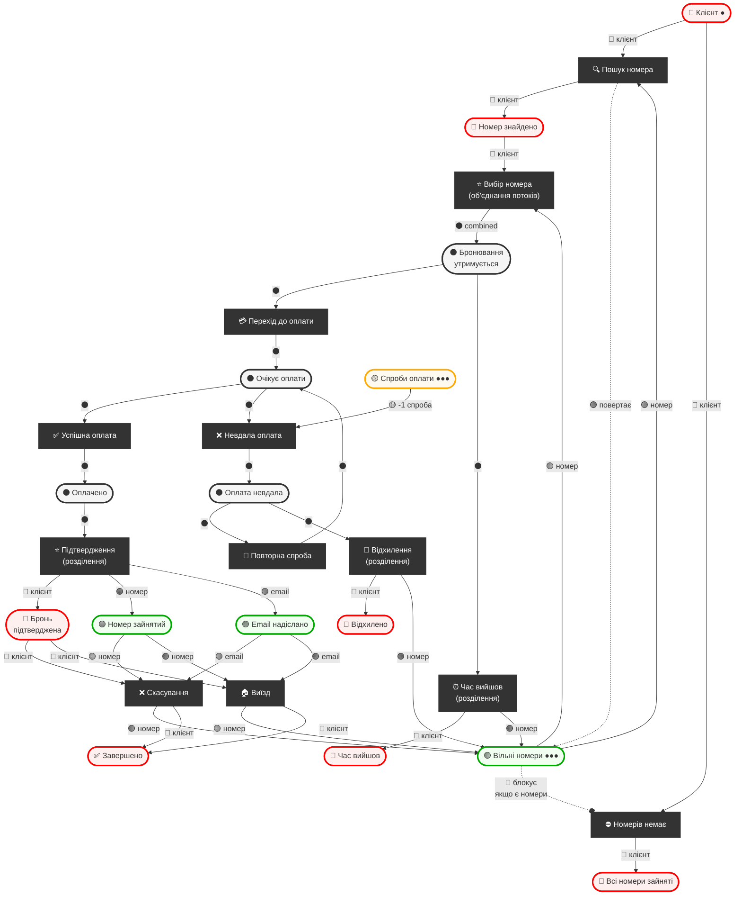

# Мережа Петрі: Система бронювання готелю

### Кольорове кодування:
- 🔴 **Червоний** - Клієнт
- 🟢 **Зелений** - Готель/Номери
- 🔵 **Синій** - Оплата
- 🟡 **Жовтий** - Лічильник спроб
- ⚫ **Чорний** - Об'єднаний потік (клієнт + номер разом)
- 🚫 **Inhibitor arc** - Блокуючий зв'язок (перехід спрацює тільки якщо місце ПУСТЕ)

### Типи дуг:
- `→` Звичайна дуга (потребує токен)
- `-.-o` Inhibitor arc (блокує якщо Є токени, спрацює якщо НЕМАЄ)

---

## Логіка потоків:

```
ФАЗА 1: Окремі потоки
┌─────────────────────────────────────┐
│  🔴 Клієнт    🟢 Номери             │
│     ↓            ↓                  │
│     └──────┬─────┘                  │
│            ↓                        │
│     [Вибір номера]                  │
│            ↓                        │
│      ⚫ Об'єднано                   │
└─────────────────────────────────────┘

ФАЗА 2: Об'єднаний потік
┌─────────────────────────────────────┐
│   ⚫ Утримання → Оплата → ...       │
│   (клієнт + номер рухаються разом)  │
└─────────────────────────────────────┘

ФАЗА 3: Розділення потоків
┌─────────────────────────────────────┐
│     [Підтвердження]                 │
│          ↓   ↓                      │
│    🔴 Клієнт  🟢 Номер              │
│         ↓       ↓                   │
│   Підтверджено  Зайнято             │
└─────────────────────────────────────┘
```

---



---

## Пояснення трьох фаз:

| Фаза | Що відбувається | Кольори |
|------|-----------------|---------|
| **1. Окремі потоки** | Клієнт і Номер існують окремо | 🔴 🟢 |
| **2. Об'єднаний потік** | Після вибору номера клієнт+номер рухаються разом | ⚫ |
| **3. Розділення** | При підтвердженні/відмові потоки знову розходяться | 🔴 🟢 |

---

## Точки об'єднання/розділення:

| Перехід | Тип | Що відбувається |
|---------|-----|-----------------|
| Вибір номера | ⭐ Об'єднання | 🔴 + 🟢 → ⚫ |
| Підтвердження | ⭐ Розділення | ⚫ → 🔴 + 🟢 |
| Відхилення | ⭐ Розділення | ⚫ → 🔴 + 🟢 |
| Час вийшов | ⭐ Розділення | ⚫ → 🔴 + 🟢 |
| Скасування | Завершення | 🔴 + 🟢 → кінець |
| Виїзд | Завершення | 🔴 + 🟢 → кінець |

---

## Кольори для Draw.io:

| Потік | Колір | HEX |
|-------|-------|-----|
| Клієнт (окремо) | Червоний | #FF0000 |
| Номер (окремо) | Зелений | #00AA00 |
| Оплата | Синій | #0066FF |
| Лічильник | Жовтий | #FFAA00 |
| **Об'єднаний** | **Чорний/Сірий** | **#333333** |

---

## Логіка пошуку номерів:

```
                    Клієнт (●)
                        │
            ┌───────────┴───────────┐
            │                       │
            ▼                       ▼
     🔍 Пошук номера        ⛔ Номерів немає
    (потребує номер)       (inhibitor від номерів)
            │                       │
    ┌───────┴───────┐               │
    │               │               │
Номери ────────────▶│     Номери ○──┤ (блокує якщо є)
(🟢 ●●●)            │     (🟢 ●●●)  │
                    │               │
                    ▼               ▼
           Номер знайдено     Всі зайняті
```

**Як це працює:**

| Стан "Вільні номери" | Пошук номера | Номерів немає | Результат |
|----------------------|--------------|---------------|-----------|
| Є номери (●●●) | ✅ Може спрацювати | ❌ Заблоковано | Клієнт знаходить номер |
| Пусто (∅) | ❌ Не може спрацювати | ✅ Може спрацювати | Клієнту повідомляють "немає номерів" |

**Inhibitor arc** (`○─`) означає: "перехід спрацює тільки якщо це місце ПУСТЕ".

Це стандартний патерн мережі Петрі для умовного розгалуження на основі наявності ресурсів.

---

## Словник назв (технічні → людські):

### Місця (Places):
| Технічна назва | Людська назва |
|----------------|---------------|
| P_client | Клієнт |
| P_rooms | Вільні номери |
| P_found | Номер знайдено |
| P_no_rooms | Всі номери зайняті |
| P_hold | Бронювання утримується |
| P_payment | Очікує оплати |
| P_attempts | Спроби оплати |
| P_paid | Оплачено |
| P_failed | Оплата невдала |
| P_rejected | Відхилено |
| P_timeout | Час вийшов |
| P_confirmed | Бронь підтверджена |
| P_occupied | Номер зайнятий |
| P_email_sent | Email надіслано |
| P_end | Завершено |

### Переходи (Transitions):
| Технічна назва | Людська назва |
|----------------|---------------|
| T_search | 🔍 Пошук номера |
| T_no_rooms | ⛔ Номерів немає |
| T_select | ⭐ Вибір номера |
| T_to_payment | 💳 Перехід до оплати |
| T_timeout | ⏰ Час вийшов |
| T_pay_success | ✅ Успішна оплата |
| T_pay_fail | ❌ Невдала оплата |
| T_retry | 🔄 Повторна спроба |
| T_reject | 🚫 Відхилення |
| T_confirm | ⭐ Підтвердження |
| T_cancel | ❌ Скасування |
| T_checkout | 🏠 Виїзд |
